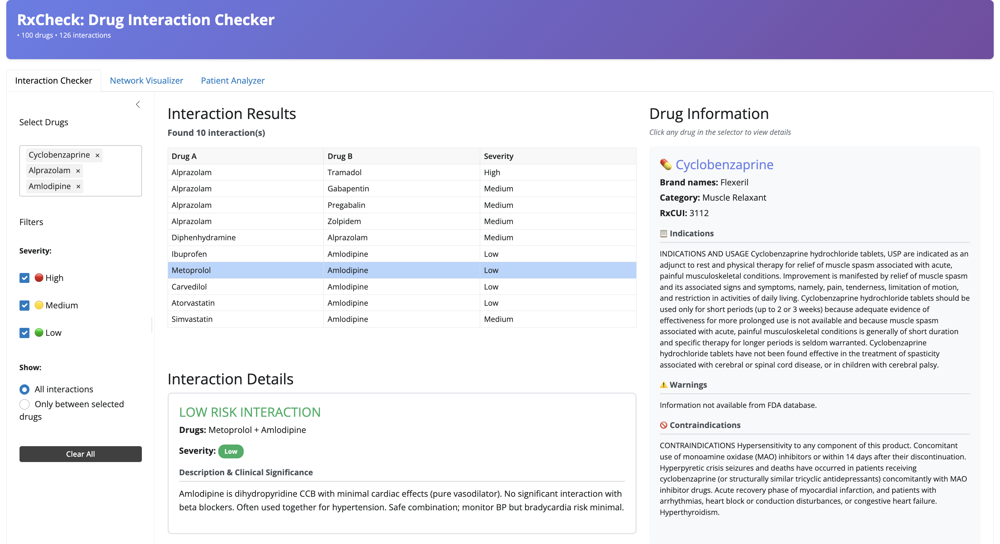
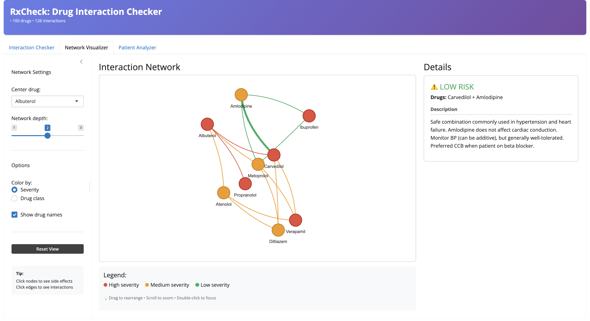
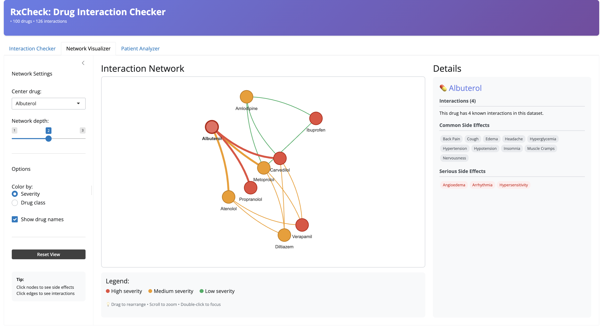
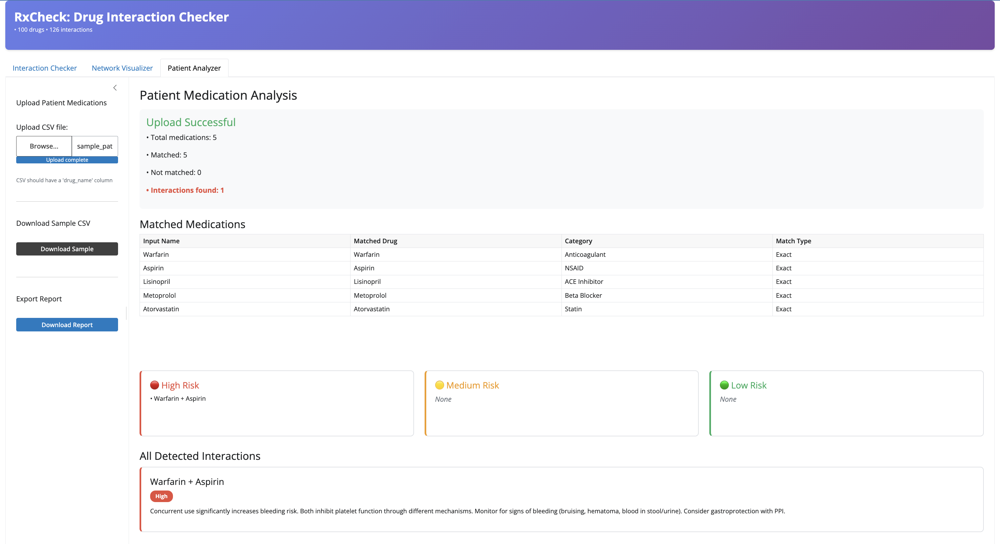

# RxCheck: Top 100 Drug Interaction Checker

An interactive tool for identifying drug-drug interactions among the most commonly prescribed medications in the United States.

## Motivation & Background

### The Problem

Polypharmacy—the concurrent use of multiple medications—affects over 40% of elderly Americans and is associated with significant health risks. Drug-drug interactions cause approximately 1.3 million emergency department visits annually in the United States. Despite the clinical significance, pharmacy and medical students often lack accessible, focused tools to practice identifying interactions among the most commonly prescribed medications.

### The Gap

Existing drug interaction checkers often require:
- Paid subscriptions (e.g., Lexicomp, Micromedex)
- Professional licenses (restricted to healthcare providers)
- Complex interfaces designed for clinical workflows
- Comprehensive databases covering thousands of drugs (overwhelming for learners)

**RxCheck** addresses this gap by providing a **free, focused, educational tool** covering the top 100 most prescribed medications.

### Target Audience

**Primary Users:**
1. Pharmacy and Medical Students - Learning drug-drug interactions 
2. Patient Advocates - Understanding medication safety 

**Specific Needs:**
- Quick interaction checking focused on commonly prescribed drugs
- Clear severity classifications (High/Medium/Low risk)
- Visual representation of complex interaction networks
- Batch checking capability for medication lists
- Tool without requiring professional database access

### Core App Functionality

#### What This App Does

**RxCheck** provides three integrated tabs for understanding drug interactions among the top 100 prescribed medications:

1. **Interaction Checker** - Multi-drug selection with interaction detection and detailed drug information
2. **Network Visualizer** - Interactive graph showing relationship patterns with integrated side effect information
3. **Patient Analyzer** - Batch analysis of medication lists with comprehensive reports

#### Key Features

- **Focused Coverage**: Top 100 most prescribed drugs
- **Curated Interaction Dataset**: Educational drug–drug interaction pairs mapped via RxNorm (RxCUI) identifiers
- **Severity Classification**: Color-coded risk levels (High/Medium/Low)
- **Interactive Visualizations**: Network graphs, interactive tables, click-to-explore functionality
- **Integrated Information**: Drug profiles and interaction details in a unified workflow
- **Batch Processing**: Upload medication lists for comprehensive analysis

### Intended Use Cases

#### Use Case 1: Pharmacy Student Studying Drug Interactions

**Scenario**: A pharmacy student is preparing for a pharmacology exam on cardiovascular medications.

**Workflow**:
1. Opens **Interaction Checker** tab
2. Selects common cardiovascular drugs: Warfarin, Aspirin, Lisinopril, Atorvastatin
3. Views interaction matrix showing Warfarin + Aspirin flagged as **High Risk**
4. Clicks interaction row to see detailed mechanism and clinical significance
5. Switches to **Network Visualizer** to see all interactions at once

**Benefit**: Visualizes complex multi-drug interactions that are difficult to track in textbooks. Students can actively explore rather than passively reading lists.

#### Use Case 2: Research Assistant Analyzing Medication Lists

**Scenario**: A research assistant has a dataset of 100 patient medication lists and needs to identify high-risk interaction prevalence.

**Workflow**:
1. Opens **Patient Medication Analyzer** tab
2. Formats patient data as CSV (drug_name column)
3. Uploads first patient's medication list
4. Reviews detected interactions (3 High-risk, 5 Medium-risk)
5. Exports summary text file
6. Repeats for remaining patients
7. Compiles statistics on interaction frequency

**Benefit**: Batch processing capability speeds up educational research projects. Standardized output facilitates data analysis.

### Benefits Over Alternative Methods

#### Compared to Professional Database Tools (Lexicomp, Micromedex)

| Feature | RxCheck | Professional Tools |
|---------|---------|-------------------|
| **Cost** | Free | $300-1,500/year |
| **Access** | No login | Requires institution license |
| **Scope** | Top 100 drugs | 1000s of drugs |
| **Learning Curve** | 5 minutes | Requires training |
| **Visualizations** | Interactive network graphs | Text-based lists |
| **Target Audience** | Students & educators | Healthcare professionals |

**RxCheck Advantage**: Accessible learning tool focused on most clinically relevant drugs.

## App Overview

RxCheck consists of **3 integrated tabs** providing comprehensive drug interaction analysis:

### **Tab 1: Interaction Checker** 
*Multi-drug selection with integrated drug information*



#### UI Elements & Functionality

**Left Sidebar:**
1. **Drug Selector** 
   - Searchable multi-select dropdown
   - Select to filter from 100 drugs
   - Selected drugs display as removable pills
   - Maximum 10 drugs can be selected simultaneously

2. **Severity Filters**
   - High (red) - Serious clinical consequences
   - Medium (orange) - Moderate risk, monitoring needed
   - Low (green) - Minor interactions

3. **Show Options**
   - All interactions - Display all involving any selected drug
   - Only between selected drugs - Show only pairwise interactions

4. **Clear All Button**
   - Quick reset of drug selections

**Main Panel (Center):**

5. **Interaction Results Table** 
   - Columns: Drug A | Drug B | Severity
   - Color-coded severity badges
   - Clickable rows to view details
   - Sortable by any column
   - Real-time updates as selections change

6. **Interaction Details Section** 
   - Appears below table when row is clicked
   - Shows severity-colored header
   - Displays full clinical description
   - Includes monitoring recommendations
   - Mechanism of interaction explanation

**Right Sidebar:**

7. **Drug Information Panel** 
   - Activated by clicking any drug in selector
   - Displays FDA-approved label information:
     - Generic name with brand names
     - Drug category (e.g., Anticoagulant, NSAID)
     - RxCUI identifier
   - Scrollable sections with independent scroll bars:
     - Indications - FDA-approved uses
     - Warnings - Boxed warnings (black box)
     - Contraindications - When not to use

**Data Source**: Interactions curated from clinical literature; drug information from OpenFDA API

### **Tab 2: Network Visualizer** 
*Interactive graph showing drug interaction patterns with integrated side effect information*

*Clicking an edge displays interaction details*


*Clicking a node shows drug's side effects*


#### UI Elements & Functionality

**Left Sidebar:**

1. **Network Settings**
   - **Center Drug Dropdown** 
     - Select focal drug for network
     - Leave blank to show all interactions
   - **Network Depth Slider** (1-3)
     - 1 = Direct connections only
     - 2 = Friends of friends
     - 3 = Third-degree connections

2. **Display Options**
   - **Color by:**
     - Severity (default) - Red/Orange/Green risk levels
     - Drug class - Group by therapeutic category
   - **Show drug names** - Toggle node labels on/off

3. **Reset View Button**
   - Clear center drug selection
   - Reset depth to 2
   - Re-center and zoom network

4. **User Tips Box**
   - "Click nodes to see side effects"
   - "Click edges to see interactions"

**Main Panel (Center):**

5. **Interactive Network Graph** 
   - **Nodes** = Drugs (circles)
     - Size represents number of connections
     - Color indicates risk level of most severe interaction
   - **Edges** = Interactions (lines)
     - Color matches severity (red/orange/green)
     - Thickness represents interaction strength
   - **Physics Simulation**
     - Nodes push apart (like magnets)
     - Connected drugs pulled together
     - Drag nodes to rearrange manually
   - **Controls:**
     - Mouse wheel = Zoom in/out
     - Click + drag background = Pan
     - Click node/edge = Show details
     - Double-click = Focus on selection

6. **Legend** (bottom)
   - 🔴 High severity
   - 🟠 Medium severity
   - 🟢 Low severity
   - Drag to rearrange • Scroll to zoom • Double-click to focus

**Right Sidebar:**

7. **Details Panel**

   **When Edge Selected** (Tab2_1.png):
   - ⚠️ Severity indicator (colored)
   - **Drugs**: Name + Name
   - **Description**: Full interaction text
   - Clinical significance
   - Monitoring recommendations

   **When Node Selected** (Tab2_2.png):
   - 💊 Drug name with emoji
   - **Interactions (N)**: Count of connections
   - **Common Side Effects** (gray pills):
     - Back Pain, Cough, Edema, Headache
     - Hyperglycemia, Hypertension, etc.
   - **Serious Side Effects** (red pills):
     - Angioedema, Arrhythmia
     - Hypersensitivity, etc.

### **Tab 3: Patient Analyzer**
*Batch medication list analysis with comprehensive risk reporting*



#### UI Elements & Functionality

**Left Sidebar:**

1. **Upload Patient Medications**
   - **File Browser** 
     - Click "Browse..." to select file
     - Or drag-and-drop CSV file
     - Shows filename when loaded
   - **Upload Complete Button**
     - Triggers analysis
     - Validates file format
   - **Format Note**: "CSV should have a 'drug_name' column"

2. **Download Sample CSV**
   - **Download Sample Button**
   - Provides example file with 5 drugs:
     - Warfarin, Aspirin, Lisinopril
     - Metoprolol, Atorvastatin
   - Use as template for formatting

3. **Export Report**
   - **Download Report Button** 
   - Plain text (.txt) format
   - Includes all interactions with descriptions
   - Adds disclaimer footer

**Main Panel:**

4. **Upload Status Banner**
   - **Green Success Box**
     - "Upload Successful"
     - • Total medications: x
     - • Matched: x
     - • Not matched: x
     - • Interactions found: x

5. **Matched Medications Table**
   - Columns: Input Name | Matched Drug | Category | Match Type
   - Shows RxCUI mapping transparency
   - Confirms drug recognition accuracy
   - "Exact" match type indicates perfect match

6. **Risk Summary Boxes** (row of 3 colored cards)
   
   **🔴 High Risk** (red border):
   - Count of high-severity interactions
   - Lists drug pairs (e.g., • Warfarin + Aspirin)
   - Empty if none: shows "None"
   
   **🟡 Medium Risk** (orange border):
   - Count of medium-severity interactions
   - Lists drug pairs
   - Empty if none: shows "None"
   
   **🟢 Low Risk** (green border):
   - Count of low-severity interactions
   - Lists drug pairs
   - Empty if none: shows "None"

7. **All Detected Interactions Section**
   - Sorted by severity (High → Medium → Low)
   - Each interaction in colored box matching severity
   - Shows:
     - Drug A + Drug B
     - Severity badge
     - Full clinical description
     
**Workflow:**
1. User uploads CSV with drug names
2. System performs fuzzy matching against database
3. Identifies all pairwise interactions
4. Categorizes by severity
5. Generates downloadable report

**CSV Format Example:**
```csv
drug_name
Warfarin
Aspirin
Lisinopril
Metoprolol
Atorvastatin
```

## User Guide

### Getting Started

1. **Access the App**
   - Open web browser
   - Navigate to app URL or run locally
   - No login or registration required

2. **Choose Your Task**
   - **Learning interactions?** → Tab 1: Interaction Checker
   - **Visualizing patterns?** → Tab 2: Network Visualizer
   - **Analyzing medication list?** → Tab 3: Patient Analyzer

### Tab 1: Quick Start

**Scenario**: "I want to check if Warfarin and Aspirin interact"

1. Click into the drug selector box
2. Select "warfarin" from dropdown
3. Select "aspirin" from dropdown
4. View interaction table - shows **High** severity
5. Click the table row for full description
6. Click "Warfarin" in selector to see drug info panel

**Tips:**
- ✅ Select up to 10 drugs at once
- ✅ Use filters to focus on high-risk interactions
- ✅ Click drugs in selector to see FDA label info
- ✅ Switch to "Only between selected drugs" for focused view

### Tab 2: Quick Start

**Scenario**: "I want to see all drugs that interact with Metoprolol"

1. Select "Metoprolol" from Center drug dropdown
2. Set Network depth to 2
3. Observe network graph:
   - Metoprolol in center
   - Connected drugs around it
   - Colors show interaction severity
4. Click any node to see side effects
5. Click any edge to see interaction details

**Tips:**
- ✅ Leave center drug blank to see full network
- ✅ Drag nodes to customize layout
- ✅ Use depth=1 for simplicity, depth=3 for comprehensive view
- ✅ Toggle "Show drug names" for cleaner visualization

### Tab 3: Quick Start

**Scenario**: "I have a patient's medication list to analyze"

1. Download sample CSV to see format
2. Create your CSV file with one column: `drug_name`
3. Click "Browse..." and select your file
4. Click "Upload complete"
5. Review matched medications table
6. Check High/Medium/Low risk boxes
7. Click "Download Report" to save results

**Tips:**
- ✅ Drug names are case-insensitive
- ✅ System handles common misspellings
- ✅ Brand names are automatically matched
- ✅ Unmatched drugs show suggestions

### Common Questions

**Q: Why doesn't my drug show FDA label information?**
A: OTC medications and supplements often have limited FDA labeling. See Limitations section for details.

**Q: How many interactions are in the database?**
A: 126 clinically significant interactions among 100 drugs.

**Q: Can I export the network visualization?**
A: Yes, use browser's screenshot tool or "Print to PDF" function.

**Q: What if my CSV has spelling errors?**
A: The fuzzy matching algorithm handles minor misspellings and brand name variations.

## References

1. **National Library of Medicine**. (2024). *RxNorm API*. National Institutes of Health. Retrieved from https://rxnav.nlm.nih.gov/

2. **U.S. Food and Drug Administration**. (2024). *OpenFDA Drug Product Labeling API*. Retrieved from https://open.fda.gov/apis/drug/label/

3. **ClinCalc**. (2024). *DrugStats Database - Top 300 Drugs of 2023*. Retrieved from https://clincalc.com/DrugStats/

4. Budnitz, D. S., Lovegrove, M. C., Shehab, N., & Richards, C. L. (2011). Emergency hospitalizations for adverse drug events in older Americans. *New England Journal of Medicine*, 365(21), 2002-2012. https://doi.org/10.1056/NEJMsa1103053

5. Maher, R. L., Hanlon, J., & Hajjar, E. R. (2014). Clinical consequences of polypharmacy in elderly. *Expert Opinion on Drug Safety*, 13(1), 57-65. https://doi.org/10.1517/14740338.2013.827660

6. Hansten, P. D., & Horn, J. R. (2020). *Drug Interactions Analysis and Management*. Wolters Kluwer Health.

7. Qato, D. M., Wilder, J., Schumm, L. P., Gillet, V., & Alexander, G. C. (2016). Changes in prescription and over-the-counter medication and dietary supplement use among older adults in the United States, 2005 vs 2011. *JAMA Internal Medicine*, 176(4), 473-482. https://doi.org/10.1001/jamainternmed.2015.8581

8. Goldberg, R. M., Mabee, J., Chan, L., & Wong, S. (1996). Drug-drug and drug-disease interactions in the ED: Analysis of a high-risk population. *American Journal of Emergency Medicine*, 14(5), 447-450. https://doi.org/10.1016/S0735-6757(96)90147-3

9. **World Health Organization**. (2023). *Technical Report Series: Safety of Medicines - A Guide to Detecting and Reporting Adverse Drug Reactions*. Geneva: WHO Press.

10. Zwart-van Rijkom, J. E., Uijtendaal, E. V., ten Berg, M. J., van Solinge, W. W., & Egberts, A. C. (2009). Frequency and nature of drug-drug interactions in a Dutch university hospital. *British Journal of Clinical Pharmacology*, 68(2), 187-193. https://doi.org/10.1111/j.1365-2125.2009.03443.x

---

_This project was crated as part of the BMI 709 course at Harvard Medical
School_
